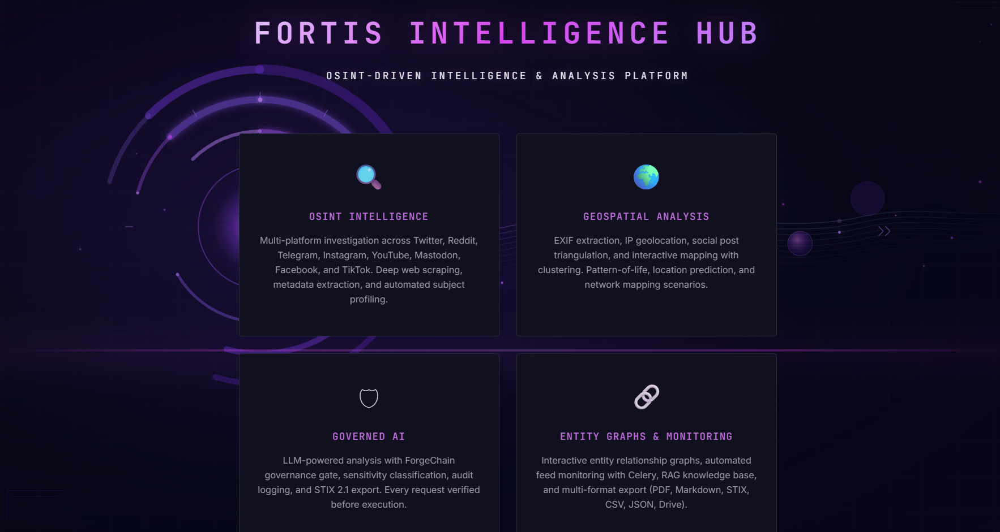

# Fortis Intelligence Hub

An OSINT-driven intelligence and analysis platform for open-source intelligence gathering, geospatial triangulation, and analyst-grade report generation.



## Key Features

- **Multi-Platform OSINT** -- Investigate usernames, emails, domains, and IPs across Twitter/X, Reddit, YouTube, Instagram, Mastodon, Facebook, TikTok, and Telegram
- **Domain & IP Intelligence** -- First-class domain/IP investigations with WHOIS, DNS records, DNSdumpster subdomain enumeration, reverse DNS, reverse IP (co-hosted domains), HTTP header probing via HackerTarget API, Wayback Machine historical enrichment, and **URL endpoint fuzzing** (curated 245-path wordlist for admin panels, API surfaces, config files, dev artifacts, and backup files — elevated authorization required)
- **Wayback Machine / Archive.org** -- Domain enrichment via CDX API: historical snapshot timeline, archived subdomain discovery, content change detection (digest comparison), and robots.txt policy history. No API key required
- **Anti-Detection HTTP** -- All outbound HTTP uses curl_cffi with Chrome TLS fingerprinting to bypass bot detection; thread-safe per-thread session isolation for Windows COM compatibility
- **API-Free Scrape Fallbacks** -- Every platform works without API keys via curl_cffi-powered scrape fallbacks (Reddit .json endpoints, Twitter syndication API, TikTok embedded JSON, Facebook mbasic)
- **Geospatial Triangulation** -- Triangulate locations from EXIF data, social geotags, IP addresses, check-ins, video landmarks, and text mentions with interactive Leaflet.js maps
- **Media Geo-Extraction** -- Automatic EXIF GPS extraction from social media images and video keyframe analysis (OCR + landmark geocoding via OpenCV)
- **AI-Powered Analysis** -- DeepSeek LLM generates investigation reports, pattern-of-life analyses, network mapping, and influence assessments. DeepSeek Vision (`deepseek-v4-flash-vision-exp`) provides multimodal image understanding for uploaded media
- **Web Intelligence** -- LLM autonomously searches the public web via Google dork queries (DuckDuckGo) to fill intelligence gaps and validate findings, with confidence-gated deep scraping of high-value results. Expanded passive recon cheatsheets for domain, IP, and email identifiers. Improved circuit breaker that correctly distinguishes "no results" from actual failures
- **Image OSINT** -- Five-module image analysis pipeline: reverse image search (Yandex CBIR + Google Lens + Bing via PicImageSearch, optional TinEye API + perceptual hash deduplication), Error Level Analysis (ELA) with clone detection for forensic tampering assessment, steganography detection (LSB extraction, RS analysis, sample pairs), CLIP zero-shot classification for scene/object/landmark recognition and safety screening, and **DeepSeek Vision AI** scene analysis (contextual image understanding, object identification, text/signage extraction, location clue detection, and OSINT relevance assessment via `deepseek-v4-flash-vision-exp`). All modules run on uploaded images during investigations and via the dedicated `/analyze-image` endpoint. DeepSeek Vision descriptions are injected directly into the LLM analysis context, enabling the analyst model to reason over detailed visual evidence rather than just CLIP label scores
- **Civilian Harm Classifier** -- Bellingcat-inspired semantic similarity scoring using sentence-transformers with multilingual conflict keyword density. Automatically flags CRITICAL/HIGH/MODERATE content across all investigation flows (investigation, batch, scenario, Q&A, feed monitor). Distribution bar, flagged item cards, and concept badges in the UI
- **Separated LLM Pipeline** -- RAG (FAISS vectorstore) for document Q&A only; Knowledge Graph (NetworkX entity relationships) for OSINT multi-source enrichment -- no token waste from parallel injection
- **RAG Knowledge Base** -- Upload PDF and Markdown reports, index them with FAISS vectorstore, and ask natural-language questions with automatic KB feedback from previous analyses
- **Analytical Scenarios** -- Generate pattern-of-life, network mapping, location prediction, and influence analysis from collected OSINT data with entity graph context
- **Feed Monitoring** -- Set up keyword, username, and hashtag monitors with Celery background tasks, automatic enrichment, and civilian harm scoring on new findings
- **GDPR & NIST CSF 2.0 Compliance** -- Tiered data retention, right to erasure (Art. 17), GDPR Art. 30 processing records, NIST CSF function mapping, system credential leak detection (subject PII is never blocked)
- **ForgeChain Governance** -- Every LLM request passes through a 3-verifier consensus gate (rule, safety, consistency) before execution
- **Analysis Integrity Framework** -- Nine-layer accuracy system: output grounding verification (semantic similarity check that report claims are present in source data), NATO Admiralty source reliability grading (A-F per source), RAG contamination guard (prevents hallucination feedback loops), competing hypotheses generation (ACH), claim decomposition (CONFIRMED/INFERRED/ASSUMED tagging), self-consistency checking (multi-run stability analysis), provenance trail (chain-of-custody from raw data to report), bias audit (source concentration, confirmation pattern, temporal skew, coverage gaps, single-source claims), and multilingual NER (xx_ent_wiki_sm with language-aware confidence)
- **Elevated Authorization** -- Investigation endpoints support elevated authorization for privileged analysts handling sensitive cases and active reconnaissance features (URL endpoint fuzzing)
- **Entity Relationship Graphs** -- Cytoscape.js-powered interactive graphs with click-to-drill-down entity detail popups; graph context fed directly to LLM for entity-aware analysis
- **Professional Export** -- PDF with section-aware layout, TLP classification banner, table of contents, and executive summary highlighting. Also Markdown (with TLP metadata), STIX 2.1, CSV, JSON, and Google Drive export with map snapshots
- **Docker Ready** -- Dockerfile and docker-compose.yml for containerized deployment with Redis, Celery worker, and Celery beat

---

## Tech Stack

### Backend

| Component | Technology |
|-----------|-----------|
| Web Framework | Flask 3.x with Jinja2 SPA |
| HTTP Client | curl_cffi (Chrome TLS fingerprinting) with thread-safe per-thread sessions, requests fallback |
| LLM | DeepSeek v4-flash (analysis) + v4-pro (governance) via `langchain-openai` + v4-flash-vision-exp (image understanding) via `openai` |
| LLM Pipeline | RAG (FAISS) for document Q&A; Knowledge Graph (NetworkX) for OSINT enrichment |
| Vectorstore | FAISS with `BAAI/bge-base-en-v1.5` embeddings |
| Database | SQLite (reports, ForgeChain audit trail, entity relationships) |
| Task Queue | Celery + Redis (feed monitoring, background enrichment) |
| NLP | spaCy (NER), langdetect (language detection) |
| Civilian Harm | sentence-transformers (paraphrase-multilingual-MiniLM-L12-v2), Bellingcat methodology |
| Image OSINT | Pillow (ELA/forensics), imagehash (perceptual hashing), numpy (steganography), CLIP (zero-shot classification via sentence-transformers), DeepSeek Vision API (contextual scene analysis) |
| Domain/IP Intel | python-whois, dnspython, HackerTarget API (DNSdumpster, reverse DNS/IP), Wayback Machine CDX API |
| Web Intelligence | duckduckgo-search (Google dork queries, no API key required) |
| Geolocation | geopy, MaxMind GeoLite2, DBSCAN clustering |
| Video Analysis | OpenCV keyframe extraction, imagehash deduplication, pytesseract OCR |
| PDF Processing | PyMuPDF, pypdf (3-tier extraction pipeline) |

### Frontend

| Component | Technology |
|-----------|-----------|
| UI | Vanilla JS single-page application |
| Maps | Leaflet.js with CartoDB Voyager tiles |
| Graphs | Cytoscape.js entity relationship visualization |
| Charts | Chart.js + Matplotlib (server-side) |
| Theme | Black and purple cyberpunk aesthetic |

### Security

| Component | Technology |
|-----------|-----------|
| AI Governance | ForgeChain -- 3 verifiers, configurable consensus gate (`FORGE_CONSENSUS_THRESHOLD`, default 2/3) |
| Authentication | Google OAuth 2.0 |
| Encryption | Fernet (ForgeChain token minting) |
| Rate Limiting | Flask-Limiter |
| Data Protection | GDPR Art. 17/30 compliance, tiered retention, system credential leak detection |
| Compliance | NIST CSF 2.0 function mapping (GV, PR, DE, RS, RC) |

---

## Prerequisites

- **Python 3.11+**
- **Git**
- **Redis** (optional -- required only for feed monitoring with Celery)

---

## Local Setup

### 1. Clone the Repository

```bash
git clone https://github.com/your-org/Fortis-Intelligence-Hub.git
cd Fortis-Intelligence-Hub
```

### 2. Create a Virtual Environment

```bash
python -m venv venv
```

Activate it:

```bash
# Windows
venv\Scripts\activate

# Linux / macOS
source venv/bin/activate
```

### 3. Install Dependencies

```bash
pip install -r requirements.txt
```

### 4. Download the spaCy NLP Model

```bash
python -m spacy download en_core_web_sm
```

### 5. Configure Environment Variables

```bash
cp .env.example .env
```

Open `.env` and configure at minimum:

```
FLASK_SECRET_KEY=<random-string>
SESSION_SECRET_KEY=<random-string>
DEEPSEEK_API_KEY=<your-deepseek-key>
```

Generate secure keys with: `python -c "import secrets; print(secrets.token_hex(32))"`

See the [OSINT API Configuration Guide](#osint-api-configuration-guide) below for all available API keys.

### 6. Run the Application

```bash
# Option A: Flask development server
python run.py

# Option B: Waitress (Windows production server)
python run_windows.py
```

The app will be available at `http://localhost:5000`.

### 7. Run with Feed Monitoring (Optional)

Feed monitoring requires Redis and Celery. Open three terminals:

```bash
# Terminal 1: Start Redis
redis-server

# Terminal 2: Start Celery worker
celery -A app.celery_app worker --loglevel=info --pool=solo

# Terminal 3: Start the app
python run.py
```

---

## OSINT API Configuration Guide

The platform supports graceful degradation -- it runs with zero API keys configured (except DeepSeek for LLM analysis). Each unconfigured platform simply shows as disabled in the UI. Configure only the sources you need.

### DeepSeek (REQUIRED)

The LLM that powers all analysis, enrichment, and governance chains.

| Env Variable | Description |
|---|---|
| `DEEPSEEK_API_KEY` | Your DeepSeek API key |
| `DEEPSEEK_BASE_URL` | API endpoint (default: `https://api.deepseek.com/v1`) |
| `DEEPSEEK_ANALYSIS_MODEL` | Model for analysis chains (default: `deepseek-v4-flash`) |
| `DEEPSEEK_FORGE_MODEL` | Model for ForgeChain governance (default: `deepseek-v4-pro`) |
| `DEEPSEEK_VISION_MODEL` | Model for image understanding (default: `deepseek-v4-flash-vision-exp`) |
| `DEEPSEEK_VISION_ENABLED` | Toggle DeepSeek Vision image analysis (default: `true`) |

**How to get the key:**

1. Register at [platform.deepseek.com](https://platform.deepseek.com)
2. New accounts receive 5 million free tokens valid for 30 days
3. Navigate to **API Keys** in the dashboard
4. Click **Create new API key** and copy it immediately
5. To continue beyond the free tier, add balance to your account

**Free tier:** 5M tokens for 30 days. After that, pay-as-you-go at approximately $0.14/$0.28 per million input/output tokens (v4-flash). The vision model (`deepseek-v4-flash-vision-exp`) uses 384 tokens per image at most, so image analysis adds minimal cost. Estimated monthly cost at moderate usage: $2--5.

**Alternative:** Both DeepSeek models are also available on Ollama Cloud. Set `DEEPSEEK_BASE_URL` to `https://ollama.com/v1` and use your Ollama API key -- no other changes needed.

---

### Twitter / X

| Env Variable | Description |
|---|---|
| `TWITTER_BEARER_TOKEN` | Bearer token for X API v2 |

**How to get the key:**

1. Go to [developer.x.com](https://developer.x.com) and sign in with your X account
2. Apply for a developer account (free tier available)
3. Create a **Project**, then create an **App** within the project
4. Navigate to **Keys and Tokens** for your app
5. Generate a **Bearer Token** and copy it

**Free tier:** The free tier allows 1,500 tweets read per month. The Basic tier ($100/month) allows 10,000 tweets read per month. Rate limit: 300 requests per 15 minutes.

---

### Reddit

| Env Variable | Description |
|---|---|
| `REDDIT_CLIENT_ID` | OAuth2 client ID |
| `REDDIT_CLIENT_SECRET` | OAuth2 client secret |
| `REDDIT_USER_AGENT` | User agent string (default: `Fortis/1.0`) |

**How to get the keys:**

1. Log in to Reddit and go to [reddit.com/prefs/apps](https://www.reddit.com/prefs/apps)
2. Scroll to the bottom and click **create another app...**
3. Select **script** as the app type
4. Fill in a name and set the redirect URI to `http://localhost:5000`
5. Click **create app**
6. The **client ID** is the string under the app name (below "personal use script")
7. The **client secret** is labeled on the page

**Free tier:** 60 requests per minute. No monthly cap for script-type apps.

---

### YouTube

| Env Variable | Description |
|---|---|
| `YOUTUBE_API_KEY` | Google API key with YouTube Data API v3 enabled |

**How to get the key:**

1. Go to [Google Cloud Console](https://console.cloud.google.com/)
2. Create a new project (or select an existing one)
3. Navigate to **APIs & Services > Library**
4. Search for **YouTube Data API v3** and click **Enable**
5. Go to **APIs & Services > Credentials**
6. Click **Create Credentials > API Key**
7. Copy the generated API key
8. (Recommended) Click **Restrict Key** and limit it to YouTube Data API v3

**Free tier:** 10,000 units per day. A search request costs 100 units, so approximately 100 searches per day.

---

### Instagram

| Env Variable | Description |
|---|---|
| `INSTAGRAM_SESSION_USER` | Optional -- Instagram username for session-based access |
| `INSTAGRAM_SESSION_FILE` | Optional -- Path to Instaloader session file |

Instagram integration uses [instaloader](https://instaloader.github.io/) for scraping public profiles and posts. No API key is required, but anonymous access is heavily rate-limited by Instagram (429 errors are common).

**Recommended:** Use a logged-in session for higher rate limits:

1. Install instaloader: `pip install instaloader`
2. Log in once: `instaloader --login YOUR_USERNAME`
3. The session file is saved at `~/.config/instaloader/session-YOUR_USERNAME`
4. Set `INSTAGRAM_SESSION_USER=YOUR_USERNAME` and `INSTAGRAM_SESSION_FILE=/path/to/session-YOUR_USERNAME`

Alternatively, import cookies from Firefox: `instaloader --login YOUR_USERNAME --sessionfile session-file 615_import_firefox_session.py`

**Without a session:** Anonymous mode works but with aggressive rate limiting (8s between requests, 8-post cap). The app gracefully skips Instagram on 429 errors without crashing the investigation.

**Rate limiting:** Custom conservative RateController (15 requests per 11-minute window, 8s minimum wait between requests).

---

### Mastodon

| Env Variable | Description |
|---|---|
| `MASTODON_INSTANCE_URL` | Your Mastodon instance URL (e.g., `https://mastodon.social`) |
| `MASTODON_ACCESS_TOKEN` | Application access token |

**How to get the key:**

1. Log in to your Mastodon instance
2. Go to **Preferences > Development > New Application**
3. Set an application name (e.g., `Fortis`)
4. Select scopes: `read:search` and `read:statuses` (or simply `read` for all read access)
5. Click **Submit**
6. Copy the **Access Token** from the application page

**Free tier:** 300 requests per 5 minutes. No monthly cap.

---

### Facebook

| Env Variable | Description |
|---|---|
| `FACEBOOK_ACCESS_TOKEN` | Graph API access token |

**How to get the key:**

1. Create a [Facebook Developer](https://developers.facebook.com/) account
2. Create a new app (select **Business** type)
3. Go to **Graph API Explorer** in the developer tools
4. Generate an access token with the permissions you need
5. For long-lived tokens, exchange the short-lived token via the token exchange endpoint

**Free tier:** 200 requests per hour. Access to public pages and posts. User data requires additional review and permissions.

---

### TikTok

| Env Variable | Description |
|---|---|
| `TIKTOK_API_KEY` | TikTok Research API key |

**How to get the key:**

1. Go to [developers.tiktok.com](https://developers.tiktok.com/)
2. Create a developer account
3. Apply for the **TikTok Research API** (requires application with research purpose justification)
4. Once approved, generate an API key from the developer portal

**Free tier:** Research API access requires approval and is limited to academic and nonprofit researchers. Rate limit: 100 requests per minute.

---

### Telegram

| Env Variable | Description |
|---|---|
| `TELEGRAM_API_ID` | Telegram application API ID |
| `TELEGRAM_API_HASH` | Telegram application API hash |
| `TELEGRAM_SESSION_PATH` | Path to the session file (default: `data/telegram_session`) |

**How to get the keys:**

1. Log in to [my.telegram.org](https://my.telegram.org)
2. Click **API development tools**
3. Fill in the application form
4. Note the **api_id** and **api_hash**

**One-time session setup:**

Telegram uses Telethon, which requires a one-time interactive phone authentication to create a reusable session file. Run the built-in setup script:

```bash
python -m app.telegram_auth
```

The script will:

1. Prompt for your phone number (with country code, e.g. `+1234567890`)
2. Send a verification code via Telegram
3. Prompt for the code (and 2FA password if enabled)
4. Save the session to `data/telegram_session.session`

After this one-time setup, the session file persists on disk and the app reuses it automatically -- no further phone input is needed. If you move the app to a different machine, copy the `.session` file along with it.

**Free tier:** 30 requests per minute. Access to public channels and groups.

---

### NewsAPI

| Env Variable | Description |
|---|---|
| `NEWSAPI_KEY` | NewsAPI.org API key |

**How to get the key:**

1. Register at [newsapi.org](https://newsapi.org/register)
2. Your API key is shown on the dashboard immediately after registration

**Free tier:** 100 requests per day, articles up to 1 month old, for development use only. Paid plans start at $449/month for production use.

---

### Shodan

| Env Variable | Description |
|---|---|
| `SHODAN_API_KEY` | Shodan API key |

**How to get the key:**

1. Register at [shodan.io](https://account.shodan.io/register)
2. Your API key is shown on your [account page](https://account.shodan.io/)

**Free tier:** Limited to 100 results per search query and 1 scan credit per month. The Membership plan ($49 one-time) unlocks higher limits.

---

### VirusTotal

| Env Variable | Description |
|---|---|
| `VIRUSTOTAL_API_KEY` | VirusTotal API key |

**How to get the key:**

1. Register at [virustotal.com](https://www.virustotal.com/gui/join-us)
2. Go to your profile and find the **API Key** section

**Free tier:** 4 lookups per minute, 500 lookups per day, 15,500 lookups per month.

---

### Google OAuth (Authentication)

| Env Variable | Description |
|---|---|
| `GOOGLE_CLIENT_ID` | OAuth 2.0 client ID |
| `GOOGLE_CLIENT_SECRET` | OAuth 2.0 client secret |
| `OAUTH_REDIRECT_URI` | Redirect URI (default: `http://localhost:5000/oauth/callback`) |

**How to set up:**

1. Go to [Google Cloud Console](https://console.cloud.google.com/)
2. Navigate to **APIs & Services > Credentials**
3. Click **Create Credentials > OAuth 2.0 Client ID**
4. Select **Web application** as the application type
5. Add `http://localhost:5000/oauth/callback` to **Authorized redirect URIs**
6. Copy the **Client ID** and **Client Secret**

To disable authentication entirely during development, set `AUTH_ENABLED=false` in `.env`.

---

### MaxMind GeoIP

| Env Variable | Description |
|---|---|
| `MAXMIND_LICENSE_KEY` | MaxMind license key for downloading the database |

**How to set up:**

1. Register for a free account at [maxmind.com](https://www.maxmind.com/en/geolite2/signup)
2. Go to **Account > Manage License Keys > Generate New License Key**
3. Download the **GeoLite2-City.mmdb** database from [the download page](https://dev.maxmind.com/geoip/geolite2-free-geolocation-data)
4. Place the file at `data/GeoLite2-City.mmdb`

**Free tier:** GeoLite2 is free with registration. Updated every 2 weeks. Falls back to ipapi.co free tier if no database is present.

### Geolocation Quality Control

| Env Variable | Description | Default |
|---|---|---|
| `GEO_CONFIDENCE_FLOOR` | Minimum confidence to accept a geo point for map/report (0.0-1.0) | `0.6` |

The geolocation assessment applies two-stage filtering:
1. **Confidence floor** — points below `GEO_CONFIDENCE_FLOOR` are rejected (removes NLP text mentions, low-confidence OCR, unreliable IP lookups)
2. **Spatial outlier rejection** — DBSCAN clustering identifies and removes geographic outliers that don't cluster with the majority of evidence

Only accepted points appear on the map and in the LLM analysis context. Rejected point counts are shown in the map legend and server logs.

---

### Google Geocoding (Optional)

| Env Variable | Description |
|---|---|
| `GOOGLE_GEOCODING_API_KEY` | Google Geocoding API key |

This is optional. The platform uses Nominatim (OpenStreetMap) as the default geocoder, which requires no API key. Google Geocoding serves as a higher-accuracy fallback.

**How to get the key:**

1. Go to [Google Cloud Console](https://console.cloud.google.com/)
2. Enable the **Geocoding API**
3. Create an API key under **Credentials**

**Free tier:** $200/month free credit ($0.005 per request = 40,000 free requests/month).

---

### Google Drive Export (Optional)

| Env Variable | Description |
|---|---|
| `GDRIVE_SERVICE_ACCOUNT_KEY` | Path to Google service account JSON key file |
| `GDRIVE_FOLDER_ID` | Target Drive folder ID for exported reports |

**How to set up:**

1. Go to [Google Cloud Console](https://console.cloud.google.com/)
2. Enable the **Google Drive API**
3. Create a **Service Account** under **IAM & Admin > Service Accounts**
4. Generate a JSON key for the service account and save it locally
5. Share the target Drive folder with the service account email
6. Set `GDRIVE_SERVICE_ACCOUNT_KEY` to the path of the JSON key file

---

### Notifications (Optional)

| Env Variable | Description |
|---|---|
| `SLACK_WEBHOOK_URL` | Slack incoming webhook URL for feed monitor alerts |
| `SMTP_HOST` | SMTP server hostname (e.g., `smtp.gmail.com`) |
| `SMTP_PORT` | SMTP server port (default: `587`) |
| `SMTP_USER` | SMTP username / email address |
| `SMTP_PASSWORD` | SMTP password or app-specific password |
| `NOTIFICATION_EMAIL` | Recipient email for feed monitor alerts |

Configure either Slack, email, or both. Feed monitor findings will be sent as alerts when new content is detected.

---

### Web Intelligence Settings

| Env Variable | Description | Default |
|---|---|---|
| `DORK_VALIDATION_ENABLED` | Master toggle for web intelligence feature | `true` |
| `DORK_MAX_QUERIES` | Max dork queries per investigation (baseline + platform + LLM-generated) | `20` |
| `DORK_RATE_PER_MINUTE` | Global rate limit for search queries | `20` |
| `DORK_RATE_PER_HOUR` | Global hourly rate limit | `60` |
| `DORK_MAX_SCRAPE_URLS` | Max URLs to deep-scrape per investigation (HIGH + MODERATE only) | `5` |
| `DORK_SEARCH_REGION` | Search region code (e.g. `us-en`, `uk-en`, `ng-en`, `wt-wt` for worldwide) | `wt-wt` |
| `DORK_SEARCH_BACKEND` | Search backend: `auto`, `google`, `bing`, `brave`, `duckduckgo`, or `all` | `auto` |

### Civilian Harm Classifier Settings

| Env Variable | Description | Default |
|---|---|---|
| `CIVILIAN_HARM_ENABLED` | Master toggle for Bellingcat-inspired civilian harm scoring | `true` |
| `HARM_MODEL_NAME` | Sentence-transformer model for semantic similarity scoring | `paraphrase-multilingual-MiniLM-L12-v2` |

The classifier uses semantic similarity against 15 civilian harm concepts (Bellingcat's strongest predictive feature) combined with multilingual conflict keyword density (English, Ukrainian, Russian, Arabic, French). Scores are computed for all posts and web mentions during investigations, batch runs, scenarios, Q&A, and feed monitor polls. The model (~400MB) downloads automatically on first use. No API key required.

### Analysis Integrity Settings

| Env Variable | Description | Default |
|---|---|---|
| `SELF_CONSISTENCY_ENABLED` | Enable multi-run self-consistency check (costs 2-3× LLM calls) | `false` |
| `SELF_CONSISTENCY_RUNS` | Number of runs for self-consistency analysis | `3` |

---

### Data Protection & Compliance Settings

| Env Variable | Description | Default |
|---|---|---|
| `DATA_RETENTION_DAYS` | Base retention period for reports (PUBLIC/INTERNAL level) | `90` |
| `CACHE_TTL_HOURS` | In-memory report cache TTL before automatic eviction | `24` |

Retention is tiered by classification level: PUBLIC and INTERNAL use the full `DATA_RETENTION_DAYS`, RESTRICTED uses half, and CONFIDENTIAL uses one-third. Reports past their retention period are hard-deleted from SQLite on startup and via `POST /compliance/retention`.

---

### Feed Monitor & Knowledge Base Settings

| Env Variable | Description | Default |
|---|---|---|
| `MONITOR_DEFAULT_INTERVAL` | Default polling interval in minutes | `15` |
| `MONITOR_MAX_ACTIVE` | Maximum concurrent active monitors | `20` |
| `KB_RETENTION_DAYS` | Days before reports are auto-archived | `90` |
| `VECTORSTORE_HMAC_KEY` | HMAC key for vectorstore integrity checks | (auto-generated) |

---

## Docker Setup

A `Dockerfile` and `docker-compose.yml` are included for containerized deployment.

### Quick Start with Docker Compose

```bash
# Copy and configure environment
cp .env.example .env
# Edit .env with your API keys

# Build and start all services (app + Redis + Celery worker + Celery beat)
docker-compose up --build
```

This starts four containers:
- **app** -- The Flask application on port 5000
- **redis** -- Redis 7 for Celery broker and feed monitor state
- **celery-worker** -- Background task worker for feed monitoring
- **celery-beat** -- Periodic task scheduler

### Standalone Docker

```bash
docker build -t fortis-intelligence-hub .
docker run -p 5000:5000 --env-file .env fortis-intelligence-hub
```

Note: Running without Redis disables feed monitoring. Core features (upload, investigation, Q&A, export) work without Redis.

---

## Usage Guide

### Report Ingestion

Upload PDF or Markdown files for AI-powered analysis. The platform extracts text using a 3-tier pipeline (PyMuPDF, pypdf fallback, OCR fallback), indexes it into the FAISS vectorstore, and makes it available for Q&A and cross-referencing.

### Investigation

Enter a username, email address, domain, IP address, or keyword. The identifier type is auto-detected and routes to the appropriate intel pipeline:

- **Username/email** -- Social media profiles, posts, web mentions, news, entity extraction
- **Domain** -- WHOIS registration data, DNS records (A/AAAA/MX/NS/TXT/SOA/CNAME), DNSdumpster subdomain enumeration, HTTP header probe, IP geolocation for all resolved addresses, Wayback Machine historical enrichment (snapshot timeline, archived subdomains, content changes, robots.txt history). With elevated authorization: URL endpoint fuzzing (245 common paths probed for admin panels, API docs, config files, backups, VCS artifacts)
- **IP address** -- Geolocation, reverse DNS (PTR), reverse IP (co-hosted domains), DNSdumpster on resolved hostname

Investigation depth:

- **Quick** -- API lookups only (fast social media or DNS queries)
- **Standard** -- API + web scraping (social media, WHOIS, DNS, DNSdumpster, news)
- **Deep** -- All sources including metadata analysis, entity extraction, and full DNSdumpster enumeration

Results include a structured report with civilian harm assessment, entity relationship graph with LLM-aware context, interactive map, domain/IP intel cards, Web Intelligence section, civilian harm distribution analysis, and DeepSeek Vision AI scene analysis for any uploaded images.

**Web Intelligence** (enabled by default, toggle per investigation):

After the investigation chain completes, the LLM runs a 4-phase web search pipeline:
1. **Gap Analysis** -- Identifies what OSINT sources missed and generates targeted dork queries
2. **Validation** -- Generates queries to cross-reference key findings against independent sources
3. **Synthesis** -- Integrates search results, rates findings as NEW_INTEL / CONFIRMED / CONTRADICTED / INCONCLUSIVE with confidence levels
4. **Deep Scrape** -- Scrapes full page content of HIGH and MODERATE confidence results for enriched analysis

All 4 phases go through ForgeChain governance. Web content is treated as untrusted (full injection scan). Uncheck "Search Web for Missing Intel" to skip this step for faster results.

### Geolocation

Triangulate locations from multiple data points:

- Upload images for EXIF GPS extraction
- Enter IP addresses for geolocation
- Paste social media posts with geotags or location mentions
- Enter coordinates manually

The interactive map (CartoDB Voyager tiles) shows markers with confidence radii, DBSCAN cluster analysis, and a triangulated probable location.

### Q&A

Ask natural-language questions about uploaded reports and previous analysis results. The RAG pipeline retrieves relevant chunks from the FAISS vectorstore and the Knowledge Base (which automatically indexes all completed analyses). When answering from KB context, a visual indicator shows that prior intelligence is being used.

### Feed Monitor

Set up automated monitors for keywords, usernames, or hashtags across configured platforms. Celery beat polls at configurable intervals (5, 15, 30, 60, or 240 minutes). New findings appear in the Watch panel for analyst review (approve or dismiss).

### Scenarios

Generate analytical scenarios from collected OSINT data:

- **Pattern of Life** -- Daily and weekly behavioral patterns from posting data
- **Network Mapping** -- Social graph and connection analysis
- **Location Prediction** -- Probable future locations based on historical patterns
- **Influence Analysis** -- Reach, engagement patterns, and influence networks

### Knowledge Base

All analysis results (investigations, enrichments, scenarios, triangulations, Q&A answers) are automatically saved to the Knowledge Base immediately upon completion. The KB panel lets you manage, search, and archive indexed reports. Search uses semantic similarity via the FAISS vectorstore. Prior analyses feed back into Q&A queries automatically.

### Export

Export reports in multiple formats:

- **PDF** -- Professional dark-themed intelligence report:
  - **Title page** with Fortis branding, report metadata, TLP classification banner, and sensitivity badge
  - **Table of contents** with numbered section references
  - **Section-aware layout** -- Markdown parsed at `## ` boundaries, each section wrapped in styled cards with numbered headers
  - **Executive summary highlighting** -- Key findings section with accent border and "KEY FINDINGS" label
  - **TLP classification** -- Full-width TLP 2.0 bar (RED/AMBER+STRICT/AMBER/GREEN/CLEAR) with Admiralty/NATO source reliability ratings
  - **Contextual visual placement** -- Geographic overview near Geolocation section, entity graph near Entity Relationships, charts near OSINT Source Analysis
  - **Geographic overview** with embedded map snapshot and geospatial data table listing all geo signals with source type, coordinates, and confidence
  - **Entity relationship graph** rendered server-side (networkx + matplotlib) with color-coded nodes and labeled edges
  - **Visual analytics** charts in 2-column grid (platform distribution, activity timeline, entity types, confidence breakdown, location frequency)
  - CSS2-compatible styling (PyMuPDF Story class), dark backgrounds, solid hex colors, block-level layout
  - Sensitivity banner and branded footer on every page
- **Markdown** -- Portable text format with metadata table and TLP classification banner
- **STIX 2.1** -- Structured threat intelligence standard for entity sharing
- **CSV** -- Tabular entity and finding data
- **JSON** -- Full structured data
- **Google Drive** -- Direct export to a configured Drive folder (all formats)

---

## Architecture Notes

### ForgeChain Governance Gate

Every LLM invocation passes through ForgeChain, a 3-verifier consensus gate:

1. **Rule Verifier** -- Checks inputs against OSINT-specific policies (prompt injection detection, minor protection, harassment detection, purpose documentation, identifier validation, system credential leak detection). Note: subject PII (emails, SSNs, credit cards, etc.) is never blocked -- collecting that data is the core purpose of OSINT
2. **Safety Verifier** (LLM-based) -- DeepSeek v4-pro evaluates the request for safety concerns, social engineering, and ethical compliance
3. **Consistency Verifier** (LLM-based) -- DeepSeek v4-pro checks that the request is consistent with the stated intent

A configurable consensus threshold (default 2-of-3, set via `FORGE_CONSENSUS_THRESHOLD`) is required to pass. Failed requests are either healed (automatically corrected) or rejected with an explanation. Investigation endpoints support `elevated_authorization` for privileged analysts handling sensitive cases (e.g., minor-adjacent investigations). All decisions are logged in the ForgeChain audit trail.

### Analysis Integrity Framework

The investigation pipeline includes a nine-layer accuracy framework that runs after LLM analysis:

| Layer | Type | What it does |
|-------|------|-------------|
| **Source Reliability** | Pre-analysis | NATO Admiralty A-F grades on every OSINT finding at collection time. Metadata-aware: verified accounts, age, engagement |
| **Claim Grounding Rules** | Prompt engineering | Investigation prompt requires CONFIRMED/INFERRED/ASSUMED tags with citations. Prohibits fabricating specific details |
| **Output Grounding Verifier** | Post-analysis | Sentence-transformers cosine similarity check: every report claim vs. source OSINT data. Verdicts: WELL_GROUNDED / PARTIALLY_GROUNDED / POORLY_GROUNDED |
| **Self-Consistency Check** | Post-analysis | Runs investigation chain N times (default 3), flags claims unstable across runs. Opt-in via `SELF_CONSISTENCY_ENABLED` |
| **Competing Hypotheses (ACH)** | Post-analysis | Generates 2-3 alternative explanations for primary conclusions with evidence matrix |
| **Bias Audit** | Post-analysis | Five deterministic checks: source concentration (>60% from one platform), confirmation pattern (zero contradiction language), temporal skew, coverage gaps, single-source entities |
| **RAG Contamination Guard** | Knowledge base | Tags LLM-generated content vs. primary sources. Labels prior analysis chunks as `[PRIOR ANALYSIS]` at retrieval. Cosine similarity threshold filters irrelevant chunks |
| **Provenance Trail** | Throughout | Chain-of-custody record: every pipeline step timestamped and attributed with data hashes |
| **Multilingual NER** | Entity extraction | Tries `xx_ent_wiki_sm` (multilingual) before falling back to `en_core_web_sm`. Language-mismatch confidence penalty |

All layers are non-fatal — if any fails, the investigation completes and reports what succeeded. Self-consistency is opt-in (`SELF_CONSISTENCY_ENABLED=true`) because it costs 2-3× LLM calls.

### Celery Beat Schedule

Feed monitors use Celery periodic tasks with configurable intervals. The beat scheduler dispatches poll tasks to the worker queue (`fortis_monitor`). Each poll checks for new content since the last run, applies auto-enrichment, and stores findings for analyst review.

### LLM Pipeline Architecture

The platform uses two separate context pipelines to avoid token waste and LLM saturation:

- **RAG Pipeline** (document Q&A only) -- When a user uploads a report and asks questions via `/ask`, the FAISS vectorstore retrieves relevant document chunks plus prior analysis results from the Knowledge Base. This pipeline is NOT used for OSINT enrichment.
- **Knowledge Graph Pipeline** (OSINT enrichment) -- When running investigations, enrichments, batch analyses, or scenarios, the entity relationship graph (NetworkX) provides structured relationship context to the LLM. No RAG chunks are injected into OSINT chains.

Both pipelines save their analysis results to the Knowledge Base after completion, creating a feedback loop where prior analyses inform future Q&A queries.

### Web Intelligence Pipeline

Web intelligence operates at **both ends** of the intelligence lifecycle -- collection first, validation last:

**Phase 1: Initial Dorking (Collection)** -- Before OSINT collection begins, the LLM generates targeted dork queries based on the identifier type and selected platforms. Results inform the OSINT client's data gathering. If no platforms are selected, a broad web sweep is performed and the LLM recommends which platforms to check.

**Phase 2: OSINT Collection** -- `osint_client.investigate()` runs with initial dork results available as context.

**Phase 3: LLM Analysis** -- The investigation chain synthesises both dork results and platform OSINT data.

**Phase 4: Final Dorking (Validation + Gap Analysis)** -- After analysis, a 4-step pipeline validates and enriches:
1. **Gap Analysis Chain** (`dork_gap_analysis_chain`) -- Identifies intelligence gaps and generates fill queries
2. **Validation Chain** (`dork_validation_chain`) -- Cross-references key findings against independent sources
3. **Synthesis Chain** (`dork_synthesis_chain`) -- Integrates results, rates as NEW_INTEL / CONFIRMED / CONTRADICTED / INCONCLUSIVE with HIGH / MODERATE / LOW confidence
4. **Deep Synthesis Chain** (`dork_deep_synthesis_chain`) -- Enriches findings with full-page content from HIGH/MODERATE confidence URLs

**Phase 5: Dissemination** -- Final report includes both initial discovery and validation results.

The pipeline uses 5 LLM chains total: `dork_collection_chain`, `dork_gap_analysis_chain`, `dork_validation_chain`, `dork_synthesis_chain`, `dork_deep_synthesis_chain`. All go through ForgeChain governance. Initial dorking is also wired into `/enrich` and `/batch-investigate`.

**Security layers:**
- All 5 chains go through ForgeChain's 3-verifier consensus gate
- Query sanitization blocks dangerous operators (`cache:`, `link:`), embedded URLs, base64 payloads, shell metacharacters (max 256 chars)
- Search results and scraped content are NOT in `trusted_keys` -- full injection pattern scan applied
- Only DuckDuckGo search API is called -- result URLs are only followed for HIGH/MODERATE confidence deep scraping
- Global rate limiting: 10 queries/investigation, 10/min, 30/hour
- Feature toggle: set `DORK_VALIDATION_ENABLED=false` to disable entirely

### Civilian Harm Analysis (Bellingcat Methodology)

The platform includes a civilian harm classifier inspired by [Bellingcat's June 2026 research](https://www.bellingcat.com/resources/2026/06/25/how-to-use-ai-to-help-find-civilian-harm/) on using machine learning to detect civilian harm indicators in social media content.

**Architecture:** Bellingcat's production system uses XGBoost with 893 features trained on 54K labeled Telegram posts. Their trained model is not open-sourced, but their core insight -- that semantic similarity to harm concepts was the strongest predictive feature -- is reproducible. The Fortis implementation uses:

1. **Semantic similarity scoring** (70% weight) -- `paraphrase-multilingual-MiniLM-L12-v2` encodes text and computes cosine similarity against 15 civilian harm concept anchors (casualties, hospital attacks, displacement, infrastructure destruction, etc.). Blends max similarity with top-3 average for stable scoring.
2. **Multilingual keyword density** (30% weight) -- Conflict-domain keyword matching across English, Ukrainian, Russian, Arabic, and French. Covers military actions, civilian impacts, war crimes, and humanitarian terms.
3. **Composite classification** -- Combined score mapped to CRITICAL (75%+), HIGH (55%+), MODERATE (35%+), LOW (15%+), NONE.

**Integration points:**
- `/investigate` -- Scores all posts and web mentions (Phase 2d), feeds flagged content into LLM context for the Civilian Harm Assessment report section
- `/batch-investigate` -- Scores consolidated analysis text
- `/scenario` -- Scores OSINT data input
- `/ask` -- Scores context, displays inline alert for harm-relevant content
- Feed monitor (`poll_monitor` task) -- Scores new findings, stores harm metadata in Redis for analyst review

**UI:** Distribution bar with colored segments, flagged content cards with classification badges and matched harm concepts, collapsible section in investigation results.

### Wayback Machine Integration

Domain investigations automatically enrich via the Wayback Machine CDX API (`app/wayback_client.py`):

1. **Historical snapshots** -- Timeline of archived captures, first/last seen dates (collapsed by day)
2. **Subdomain discovery** -- Extracts unique subdomains from all archived URLs (`*.domain` pattern)
3. **Content change detection** -- Compares content digests across snapshots to identify when pages changed
4. **robots.txt history** -- Distinct versions of robots.txt over time (may reveal hidden paths or policy changes)

Rate limited at 1 request per 2 seconds (archive.org policy), with 5-second backoff on 429. No API key required. Findings are merged into `web_mentions` and appear in the investigation report under OSINT Source Analysis.

### FAISS Vectorstore

Documents are embedded using `BAAI/bge-base-en-v1.5` (768 dimensions) and stored in a FAISS index. The RAG pipeline uses similarity search to retrieve relevant chunks for document Q&A. Analysis results from all routes are automatically indexed into the KB after completion.

### Graceful Degradation

The platform is designed to run with minimal configuration. Core features that work without any OSINT API keys:

- PDF/Markdown upload and RAG Q&A
- Domain/IP investigation (WHOIS, DNS, DNSdumpster -- no API key needed)
- Wayback Machine domain enrichment via CDX API (no API key needed)
- Web intelligence dork search via DuckDuckGo (no API key needed)
- All 8 social platforms via curl_cffi scrape fallbacks (no API keys needed)
- Civilian harm analysis via sentence-transformers (no API key needed, model downloads automatically)
- Image forensics (ELA, clone detection, metadata analysis) via Pillow (no API key needed)
- Steganography detection (LSB, RS analysis, sample pairs) via Pillow + numpy (no API key needed)
- CLIP zero-shot image classification via sentence-transformers (no API key needed, model downloads automatically)
- DeepSeek Vision AI scene analysis (uses existing `DEEPSEEK_API_KEY` -- no additional key needed)
- Manual EXIF extraction from uploaded images
- Manual coordinate entry for triangulation
- Knowledge Base management
- All export formats (PDF with TLP classification, Markdown, STIX, CSV, JSON)
- ForgeChain governance

### API-Free Fallbacks

Every social platform works without API keys via curl_cffi-powered scrape fallbacks with Chrome TLS fingerprinting. When an API key is configured, it is always preferred (faster, richer data). Fallbacks activate automatically when keys are absent.

| Platform | API Path | No-API Fallback | Method |
|---|---|---|---|
| Twitter/X | `TWITTER_BEARER_TOKEN` | **Syndication API scrape** | Fetches public timelines via Twitter's syndication endpoint |
| Reddit | `REDDIT_CLIENT_ID` | **Reddit .json API** | Appends `.json` to Reddit URLs for structured data |
| TikTok | `TIKTOK_API_KEY` | **Embedded JSON scrape** | Parses `__UNIVERSAL_DATA_FOR_REHYDRATION__` / `SIGI_STATE` from page HTML |
| Facebook | `FACEBOOK_ACCESS_TOKEN` | **mbasic.facebook.com scrape** | Fetches the mobile-basic version for public page content |
| Instagram | (none needed) | **Instaloader** | Scrapes public profiles and posts with built-in throttling (3s delay, 12-post cap) |
| Mastodon | `MASTODON_ACCESS_TOKEN` | **Cross-instance search** | Queries 6 major instances directly (mastodon.social, mastodon.online, mstdn.social, infosec.exchange, hachyderm.io, fosstodon.org) |

All scrape fallbacks use the anti-detection HTTP client (`curl_cffi`) for browser-like TLS fingerprints. No additional dependencies or Playwright installations required.

### News Enrichment (RSS)

Investigation enrichment automatically queries curated RSS feeds from major news sources alongside NewsAPI:

- **BBC News** and **BBC World**
- **CNN Top Stories** and **CNN World**
- **Reuters**
- **AP News**
- **Al Jazeera**

When `NEWSAPI_KEY` is configured, both NewsAPI results and RSS results are merged and deduplicated. When it is not configured, RSS feeds provide free news enrichment with no API key required.

### Mastodon Content Search

Mastodon content search uses a multi-layer approach because the `/api/v2/search` endpoint only returns posts the authenticated user has interacted with:

1. **Hashtag timeline** (`/api/v1/timelines/tag/:tag`) -- Public posts across the fediverse matching query terms
2. **Search API** (`/api/v2/search?type=statuses`) -- Posts from the user's own interactions
3. **Public timeline** (feed monitor only) -- Federated timeline filtered by keyword for background monitoring

Results are deduplicated across all layers.

### URL Endpoint Fuzzing (Elevated Authorization)

Domain investigations include an optional URL endpoint fuzzing module (`app/url_fuzzer.py`) that probes the target domain for common exposed endpoints. This is an **active reconnaissance** technique -- it sends HTTP requests to the target -- and is gated behind `elevated_authorization` (admin users only).

**Wordlist:** 245 curated paths covering:
- Admin panels and login pages (WordPress, cPanel, phpMyAdmin, etc.)
- API surfaces and documentation (Swagger, OpenAPI, GraphQL, REST endpoints)
- Configuration and sensitive files (.env, config.json, wp-config.php, credentials)
- Version control artifacts (.git/HEAD, .svn, .gitlab-ci.yml, Dockerfile)
- Backup and archive files (backup.sql, site.zip, dump.sql)
- Debug and development endpoints (actuator, server-status, phpinfo)
- CMS-specific paths (WordPress, Joomla, Drupal, Ghost)
- Cloud storage references (AWS credentials, S3, Azure)
- Monitoring dashboards (Grafana, Kibana, Jenkins, Sentry)
- Auth and SSO endpoints (OAuth, SAML, OpenID configuration)

**Severity classification:** Each discovered endpoint is classified as CRITICAL, HIGH, MEDIUM, LOW, or INFO based on the path and HTTP status code. Exposed `.env` files, git configs, and database dumps returning HTTP 200 are classified as CRITICAL. Admin panels and API documentation are HIGH. API endpoints returning JSON are MEDIUM.

**Rate limiting:** Configurable concurrency (default 5 threads) and rate limit (default 10 req/s) via `URL_FUZZ_CONCURRENCY` and `URL_FUZZ_RATE_LIMIT`. Uses the same curl_cffi stealth HTTP client as the rest of the platform.

**Results:** Findings appear in the Domain Intelligence section of the investigation report with a severity distribution bar, and are injected into the LLM analysis context for the analyst model to reason over.

| Env Variable | Default | Description |
|---|---|---|
| `URL_FUZZ_ENABLED` | `true` | Master toggle for URL endpoint fuzzing |
| `URL_FUZZ_CONCURRENCY` | `5` | Maximum concurrent probe threads |
| `URL_FUZZ_TIMEOUT` | `8` | Per-request timeout in seconds |
| `URL_FUZZ_RATE_LIMIT` | `10` | Maximum requests per second |

---

### Image EXIF Triangulation

The geolocation card supports direct image uploads for GPS triangulation. Upload JPEG/TIFF images with embedded EXIF geolocation data, and the platform will:

1. Extract GPS coordinates from each image's EXIF metadata
2. Plot all extracted locations on the interactive map
3. Run DBSCAN clustering and triangulation to identify probable areas of interest
4. Generate an AI analysis of the geographic pattern

---

### Image OSINT Analysis

The platform includes five image analysis modules that run on uploaded images during investigations and via the `/analyze-image` endpoint:

| Module | Function | Dependencies | API Key |
|---|---|---|---|
| **Reverse Image Search** | Yandex CBIR + Google Lens + Bing reverse search (PicImageSearch), perceptual hash dedup cache | PicImageSearch, imagehash, Pillow | None (free); `TINEYE_API_KEY` optional |
| **Error Level Analysis** | JPEG re-compression forensics, clone detection via block matching, metadata strip detection | Pillow, numpy | None |
| **Steganography Detection** | LSB extraction, RS analysis, sample pairs statistical test | Pillow, numpy | None |
| **CLIP Vision** | Zero-shot image classification (22 OSINT categories), landmark detection (50 locations), content safety screening | sentence-transformers (CLIP model) | None |
| **DeepSeek Vision AI** | Contextual scene description, object/entity identification, text/signage transcription, location clue analysis, temporal clue detection, OSINT relevance assessment | openai (OpenAI-compatible client) | `DEEPSEEK_API_KEY` (shared with LLM) |

All modules degrade gracefully -- missing optional dependencies disable individual modules without affecting others. CLIP leverages the same `sentence-transformers` infrastructure used by the civilian harm classifier. The perceptual hash cache (LRU, max 5000 entries) enables cross-investigation duplicate detection.

**DeepSeek Vision** uses the `deepseek-v4-flash-vision-exp` model via the same API key and base URL as the text LLM. It provides free-form, contextual image understanding — the model actually sees the image and returns structured OSINT observations including scene description, visible text transcription, location/temporal clues, and intelligence relevance assessment. Vision descriptions are injected into the LLM analysis context alongside CLIP classifications, enabling the analyst model to reason over detailed visual evidence. Supports JPEG, PNG, GIF, and WebP images up to 32 MB, with detail level control (`low`/`high`/`auto`).

**Environment variables:**

| Variable | Default | Description |
|---|---|---|
| `TINEYE_API_KEY` | (none) | Optional TinEye API key (paid) for exact-match search |
| `IMAGE_SEARCH_ENABLED` | `true` | Toggle reverse image search module |
| `IMAGE_FORENSICS_ENABLED` | `true` | Toggle ELA/forensics module |
| `IMAGE_STEGO_ENABLED` | `true` | Toggle steganography detection module |
| `IMAGE_VISION_ENABLED` | `true` | Toggle CLIP vision classification module |
| `CLIP_MODEL_NAME` | `clip-ViT-B-32` | CLIP model for zero-shot classification |
| `IMAGE_SEARCH_TIMEOUT` | `30` | Per-engine timeout in seconds for reverse image search |
| `DEEPSEEK_VISION_ENABLED` | `true` | Toggle DeepSeek Vision AI scene analysis module |
| `DEEPSEEK_VISION_MODEL` | `deepseek-v4-flash-vision-exp` | DeepSeek Vision model for contextual image understanding |

### Media Geolocation Enrichment

#### Automatic Media Geo-Extraction

Every OSINT enrichment captures `media_urls` from social media posts. The pipeline automatically:

1. **Downloads media from enrichment results** -- Fetches images referenced in `media_urls` from each platform's normalised post data (up to 50 images per investigation)
2. **Runs EXIF extraction on all collected media** -- Feeds downloaded images through `MetadataExtractor.extract_geo_from_images()` to extract GPS coordinates (confidence: 0.95)
3. **Injects extracted coordinates into the geospatial pipeline** -- EXIF-derived locations join geotags, IP geolocation, text-mentioned places for triangulation and mapping

#### Video Frame Geolocation

Estimates location from video content using OpenCV keyframe analysis (`app/video_geo.py`):

1. **Frame extraction** -- Extracts keyframes at 2-second intervals from video URLs (up to 30 frames per video, 10 videos per investigation)
2. **Perceptual deduplication** -- Uses imagehash (pHash) to skip near-duplicate frames (hamming distance < 8)
3. **EXIF from video frames** -- Extracts GPS metadata embedded in video frame headers (source: `video_exif`, confidence: 0.90)
4. **OCR + geocoding** -- When pytesseract is installed, detects text in frames (signs, banners, watermarks) and geocodes location mentions via spaCy NER + Nominatim (source: `video_landmark`, confidence: 0.50-0.55)
5. **Text region detection** -- OpenCV MSER detects text-heavy regions in frames for targeted OCR analysis

**Optional dependencies**: `opencv-python>=4.9.0`, `imagehash>=4.3.0`, `pytesseract` (for OCR). The system degrades gracefully — without OpenCV, video analysis is skipped entirely.

#### Unified Geo Signal Aggregation

All geolocation signals from an investigation are aggregated onto a single map with automatic triangulation:

| Signal Source | Method | Confidence | Source Type |
|---|---|---|---|
| Image EXIF GPS | `MetadataExtractor.extract_geo_from_images()` | 0.95 | `exif` |
| Video frame EXIF | `VideoGeoExtractor` keyframe analysis | 0.90 | `video_exif` |
| Video OCR landmarks | Frame OCR + NER geocoding | 0.50-0.55 | `video_landmark` |
| Social geotags | Platform check-ins and place objects | 0.85 | `geotag` |
| NLP location mentions | spaCy GPE/LOC entities + Nominatim geocoding | 0.55 | `nlp_mention` |
| IP geolocation | GeoIP2 / MaxMind | varies | `ip` |

Each signal carries confidence scores and source attribution. When 2+ geo points exist, automatic weighted-centroid triangulation (with DBSCAN clustering for 5+ points) computes a confidence radius and center point. The map legend dynamically shows only the source types present in each investigation.

The investigation pipeline (`OSINTClient.investigate()`) runs geo extraction in this order:
1. `_extract_geo()` -- Social geotags from post metadata
2. `_extract_media_geo()` -- EXIF GPS from downloaded images
3. `_extract_video_geo()` -- Video keyframe analysis (requires OpenCV)
4. `_geocode_entity_locations()` -- NLP-extracted place names geocoded to coordinates

### Data Protection & Compliance

The platform implements GDPR and NIST CSF 2.0 controls for lawful OSINT processing:

**GDPR compliance:**

| Article | Implementation |
|---|---|
| Art. 5 (Purpose limitation) | Investigation purpose field required for all investigation endpoints; data scoped to session IDs |
| Art. 5 (Data minimisation) | Depth controls (quick/standard/deep) limit collection scope; LLM analysis filters noise |
| Art. 6 (Lawful basis) | Investigation purpose documents legitimate interest or public task basis |
| Art. 17 (Right to erasure) | `POST /data/subject-delete` hard-deletes all data for a subject across all stores |
| Art. 25 (Data protection by design) | Sensitivity classification (PUBLIC/INTERNAL/RESTRICTED/CONFIDENTIAL) with tiered retention |
| Art. 30 (Processing records) | `GET /compliance/processing-record` generates full GDPR Art. 30 record from current data state |
| Art. 32 (Security of processing) | ForgeChain governance, authentication, rate limiting, input sanitisation, injection scanning |

**PII handling policy:** Subject PII (emails, SSNs, credit cards, phone numbers, addresses, etc.) is **never blocked** by ForgeChain. An OSINT tool's purpose is to collect and analyse all publicly available data about investigation subjects. Only the **platform's own credentials** (API keys, private keys) are detected and blocked to prevent system secret leakage.

**Tiered data retention:**

| Classification | Retention Period | Description |
|---|---|---|
| PUBLIC | `DATA_RETENTION_DAYS` (default 90) | No PII, general trends only |
| INTERNAL | `DATA_RETENTION_DAYS` (default 90) | Contains identifying details |
| RESTRICTED | Half of `DATA_RETENTION_DAYS` (min 30) | Sensitive location or behavioural patterns |
| CONFIDENTIAL | Third of `DATA_RETENTION_DAYS` (min 14) | Could endanger if disclosed |

Reports past their retention period are hard-deleted from SQLite on startup and via `POST /compliance/retention`. In-memory cache entries expire after `CACHE_TTL_HOURS` (default 24).

**NIST CSF 2.0 mapping:**

| Function | Control |
|---|---|
| Govern (GV.PO) | ForgeChain governance policy -- 3-verifier consensus gate |
| Govern (GV.RM) | Risk management via sensitivity classification |
| Protect (PR.AA) | Google OAuth + session management; per-endpoint rate limiting |
| Protect (PR.DS) | Input/output sanitisation, injection scanning, trusted/untrusted key separation |
| Protect (PR.PS) | Security headers (CSP, HSTS, X-Frame-Options), dependency pinning |
| Detect (DE.CM) | Prompt injection detection, harassment/stalking detection, minor protection |
| Detect (DE.AE) | ForgeChain audit trail (ForgeBlocks), verifier vote logging |
| Respond (RS.AN) | Policy veto blocks with reason codes, fail-open with low confidence logging |
| Respond (RS.MI) | Rate limiting, query sanitisation, confidence-gated deep scraping |
| Recover (RC.CO) | Graceful degradation when APIs unavailable |

**Compliance endpoints (admin only):**
- `GET /compliance/processing-record` -- GDPR Art. 30 processing record
- `POST /compliance/retention` -- Enforce tiered retention policy
- `POST /data/subject-delete` -- Right to erasure for a subject identifier
- `GET /compliance/classification` -- View classification levels and NIST mapping

---

## Project Structure

```
Fortis-Intelligence-Hub/
|-- run.py                       # Flask dev server entry point
|-- run_windows.py               # Waitress production server (Windows)
|-- requirements.txt             # Python dependencies
|-- Dockerfile                   # Container build
|-- docker-compose.yml           # Multi-container orchestration
|-- .env.example                 # Environment variable template
|
|-- app/
|   |-- __init__.py
|   |-- web.py                   # Flask app factory + all routes
|   |-- chains.py                # LLM prompt templates (15 chains: 8 OSINT + 5 web intel + consolidation + intent, with civilian harm assessment)
|   |-- llm.py                   # DeepSeek LLM factory
|   |-- http_client.py           # Thread-safe HTTP session factory (curl_cffi / requests)
|   |-- osint_client.py          # OSINT aggregator (unified geo pipeline, domain/IP intel)
|   |-- image_search.py          # Reverse image search (Yandex, Google Lens, Bing, perceptual hash)
|   |-- image_forensics.py       # ELA tampering detection + clone detection
|   |-- image_stego.py           # Steganography detection (LSB, RS analysis, sample pairs)
|   |-- image_vision.py          # CLIP zero-shot classification + landmark detection
|   |-- image_deepseek_vision.py # DeepSeek Vision AI scene analysis + OSINT assessment
|   |-- url_fuzzer.py            # URL endpoint fuzzing for domain recon (elevated auth)
|   |-- video_geo.py             # Video keyframe extraction + landmark geolocation
|   |-- social_client.py         # Social media integrations (API + curl_cffi scrape fallbacks)
|   |-- telegram_auth.py         # One-time Telegram session setup (python -m app.telegram_auth)
|   |-- geo_client.py            # Geolocation + triangulation
|   |-- metadata_extractor.py    # EXIF, NER, language detection
|   |-- dork_search.py            # DuckDuckGo dork search client + rate limiter
|   |-- dork_sanitizer.py         # Query/result sanitization + anti-exfiltration
|   |-- wayback_client.py         # Wayback Machine CDX API client (domain history, subdomains)
|   |-- bias_audit.py             # Cognitive bias detection (5 checks)
|   |-- civilian_harm.py          # Bellingcat-inspired civilian harm classifier
|   |-- compliance.py            # GDPR/NIST compliance: retention, erasure, processing records
|   |-- web_scraper.py           # News, WHOIS, DNS, DNSdumpster, reverse DNS/IP, RSS
|   |-- export.py                # PDF/Markdown export
|   |-- export_ioc.py            # STIX, CSV, JSON export
|   |-- rag_store.py             # FAISS vectorstore
|   |-- report_store.py          # SQLite report persistence
|   |-- intel_graph.py           # Entity relationship graph
|   |-- charts.py                # Server-side chart generation
|   |-- feed_monitor.py          # Feed monitor management
|   |-- tasks.py                 # Celery background tasks (poll, enrich)
|   |-- celery_app.py            # Celery configuration + beat schedule
|   |-- redis_store.py           # Monitor state store
|   |-- gdrive_client.py         # Google Drive export client
|   |-- constants.py             # Platform configs, endpoints
|   |-- notifications.py         # Slack/email alerts
|   |-- provenance.py            # Chain-of-custody tracking
|   |-- self_consistency.py      # Multi-run claim stability analysis
|   |-- source_reliability.py    # NATO Admiralty source grading
|   |
|   |-- forge/                   # ForgeChain governance
|   |   |-- gate.py              # Consensus gate
|   |   |-- verifiers.py         # Rule, safety, consistency
|   |   |-- gated_invoke.py      # Governed LLM invocation
|   |   |-- executor.py          # Action execution
|   |   |-- healer.py            # Failed output healing
|   |   |-- grounding_verifier.py # Post-LLM output grounding check
|   |   +-- ...
|   |
|   |-- auth/                    # Google OAuth + sessions
|   +-- utils/                   # PDF reader, uploads, sanitizer
|
|-- templates/
|   |-- index.html               # Main SPA
|   +-- welcome.html             # Landing page
|
|-- static/
|   |-- css/styles.css           # Black + purple cyberpunk theme
|   +-- js/
|       +-- app.js               # Application logic (SPA + Leaflet maps)
|
|-- data/                        # SQLite databases, GeoIP database
|-- vectorstores/                # FAISS indices
|-- logs/                        # Application logs
+-- plans/                       # Architecture and design docs
```

---

## License

This project is proprietary. All rights reserved.
